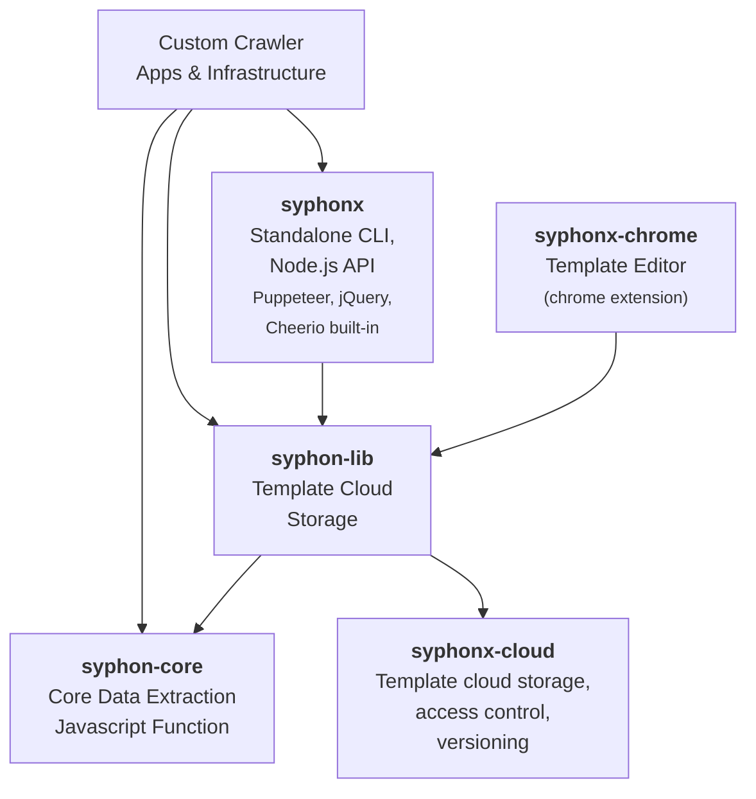
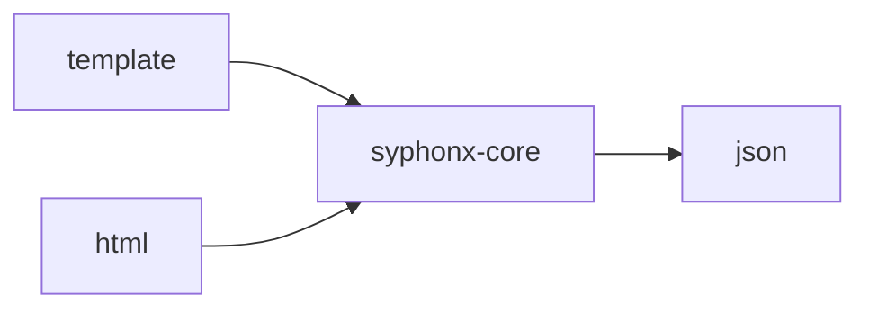
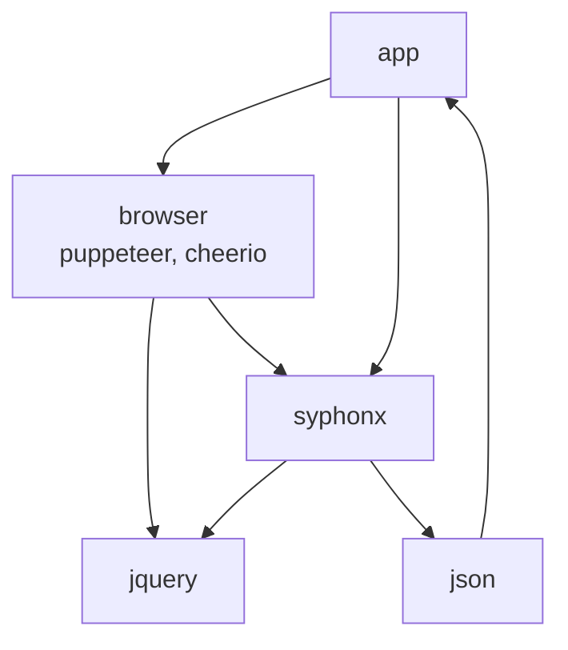

# Overview



# Dev Setup
```
git clone https://github.com/dtempx/syphonx-chrome.git
cd syphonx-chrome
yarn install
```

## Build/Test
* `yarn build-test` to build for tests
* `yarn test` to run tests

## Build/Package
* `yarn build` to build Chrome Extension package
* `yarn start` to test UI outside of Chrome
* `yarn upgrade syphonx-lib --latest` to update dependencies

## Test Chrome Extension
1. Open Chrome web-browser
2. Goto `chrome://extensions` to open the **Extensions** page
3. Click `Load unpacked` and navigate to `dist` folder to load Chrome Extension

## Install Chrome Extension
1. Open Chrome and navigate to **chrome://extensions**
2. Click **Load unpacked**, navigate to the `dist` folder within this project and click **Select Folder**
3. Navigate to any website and open developer tools or hit F12
4. Select the **SyphonX** tab within the developer tools panel.


## Deploy
1. Commit and push to main
2. Run `yarn deploy` to publish a release

## Re-Deploy
1. Run `gh release delete v0.9.9` to delete an existing release
2. Run `git tag -d v0.9.9` to delete the corresponding tag
3. Run `yarn deploy` to re-publish an existing release


# Debugging

## Browser debugging

## Debug SyphonX in browser
1. Open the browser's developer console by hitting F12
2. Copy/paste contents of `dist/syphonx.js` file into the console
3. Paste the code below to run a SyphonX query
```js
await window.syphonx.extract({actions:[{select:[{name:"title",query:[["h1"]]}]}]})
```
### Run SyphonX query manually within the page context
1. Hit F12 from the active tab to open devtools and goto Console
2. Change the **console** window context from `top` to `SyphonX`
3. Paste the code below to run a SyphonX query
```js
await window.syphonx.extract({actions:[{select:[{name:"title",query:[["h1"]]}]}]})
```
### Debug SyphonX within the page context
1. Hit F12 from the active tab to open devtools and goto Sources
2. Change the **sources** window context from `Page` to `Content scripts`
3. Expand the `SyphonX` node and select `syphonx.js`
4. Set a breakpoint in the code editor

## Chrome extension debugging

### Debug Chrome extension panel
1. Right click anywhere in the panel and select **inspect** to open the devtools window for the panel
2. Select **Sources** view
3. Drill down to **top > panel.html > {id} > src > panel > index.tsx** (or other desired source location)
4. Set a breakpoint in the code editor

### Debug Chrome extension background
1. Goto chrome://extensions
2. Click the `service worker` to open devtools window
3. Select **Sources** view
4. Click on **Page** in the left pane and expand items to find the file to debug
5. Set a breakpoint in the code editor

### Add jQuery to any page in browser
```js
(() => {
    const script = document.createElement('script');
    script.src = 'https://ajax.googleapis.com/ajax/libs/jquery/3.6.0/jquery.slim.min.js';
    document.getElementsByTagName('head')[0].appendChild(script);
    //jQuery.noConflict();
})();
```

# More Diagrams

## Data Flow


## Hosting


# General Info

## Workaround for unit tests
Note the `--experimental-specifier-resolution=node` flag added to the `test` command in `package.json`. Without this flag tests will fail with a `ERR_MODULE_NOT_FOUND` error. This project uses more modern ECMAScript modules (ESM) which are enabled by specifying `"type": "module"` in `package.json`. However, ESM also requires specifying the `.js` extension in all imports throughout the code. Unfortunately, this is incompatible with the parcel packager that builds the bundled chrome extension. Adding this flag causes the Node.js to relax requiring the `.js` file extensions when loading ESM modules, thereby providing a workaround that allows running tests and bundling the chrome extension.

To enable debugging of unit tests within vscode, change `program` from `${workspaceFolder}/node_modules/mocha/bin/_mocha` to `${workspaceFolder}/node_modules/mocha/lib/cli/cli.js` in the `launch.json` configuration. The `_mocha` entry point is nothing more than shim to `cli.js` but it uses `require` which doesn't work with ESM.

## Debug code running in the browser
Try https://www.builder.io/blog/debug-nodejs

See the following links for more info...
* https://github.com/TypeStrong/ts-node/discussions/1781
* https://github.com/nodejs/node/issues/41465


# Links
* [Material UI Documentation](https://v4.mui.com/)
* [Chrome Extending DevTools](https://developer.chrome.com/docs/extensions/mv3/devtools/)
* [Building a Chrome Extension with TypeScript (starter overview)](https://www.youtube.com/watch?v=01vp9cYbQus)

How to get the Selected elements in Chrome Panel? [Chrome Extension Development] [XPath Selenium]
https://www.youtube.com/watch?v=tFpU95kMJ7U&list=PL699Xf-_ilW7aQ6lBWXjaIheZsduOpcR5&index=10

```js
chrome.devtools.panels.elements.createSidebarPane("LetXPath", panel => {
    chrome.devtools.panels.elements.onSelectionChanged.addListener(() => {
        panel.setExpression(`$0.attributes`);
    });
});
```

Build XPath Form Selected Node | Chrome Extension Development | XPath Selenium | LetCode
https://www.youtube.com/watch?v=EuGxrTCj5Ac&list=PL699Xf-_ilW7aQ6lBWXjaIheZsduOpcR5&index=12

* https://developer.chrome.com/docs/extensions/mv3/getstarted/
* https://developer.chrome.com/docs/extensions/mv3/devtools/
