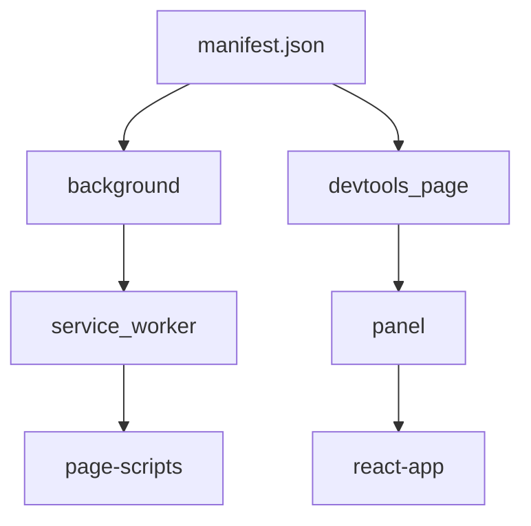
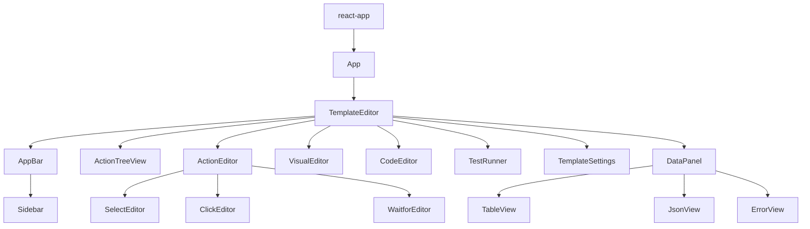

## Manifest


The manifest.json file defines two key components of a Chrome extension - a background script and a devtools page.
Each of these components serves a different purpose and has different capabilities.

```json
{
  "background": {
      "service_worker": "service_worker.js"
  },
  "devtools_page": "devtools.html"
}
```

## Background Service Worker (service_worker)

The background script is like the "backend" or the "daemon" of your Chrome extension. It is capable of:

* Running at all times in the background, even when no pages are open.
* Listening for and reacting to various browser events like button clicks, new tabs opening, changing pages, etc.
* Communicating with content scripts and exchanging messages.
* Making cross-origin AJAX requests.
* Interacting with various Chrome APIs which cannot be accessed by content scripts.
* Storing data between sessions using the chrome.storage API.

The background script cannot directly manipulate the DOM of web pages and doesn't have access to the page's JavaScript context.

## DevTools Page (devtools.html)

A devtools page is a custom HTML page that can extend the functionality of Chrome's developer tools. This is typically used to add custom tools which can help in debugging specific types of webpages. A devtools page:

* Can access some Chrome extension APIs and can communicate with background pages and content scripts, which makes it possible to build rich integrations.
* Can be used to create custom panels and sidebars in the Chrome developer tools.
* Has a separate JavaScript context from the web page and from the rest of the Chrome Developer Tools.
* Does not have access to the DOM of the inspected page directly but it can communicate with content scripts that can manipulate the DOM.

The devtools page cannot listen to most of the browser events and also doesn't run persistently, it's only active when the DevTools window is open. Furthermore, it can't make cross-origin requests unless the domain is included in the permissions of the manifest file.

In summary, each of these components has different capabilities and are suited to different tasks within a Chrome extension. The background service worker is more suited to tasks that need to run persistently or in response to browser events, while a devtools page can be used to add custom functionality to the Chrome Developer Tools.


## React App
