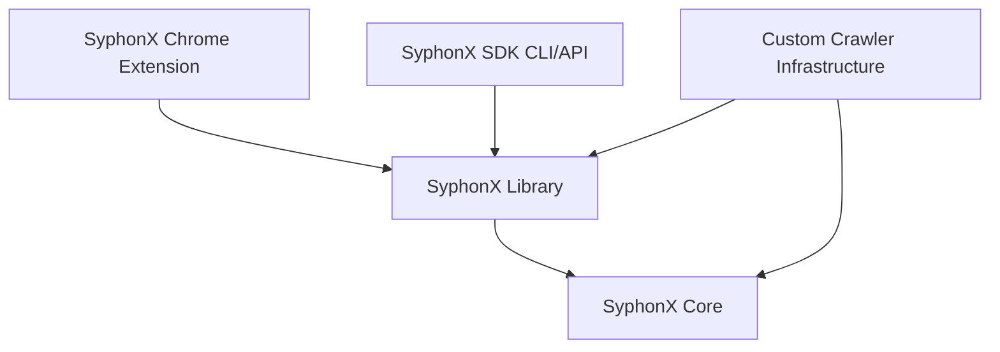
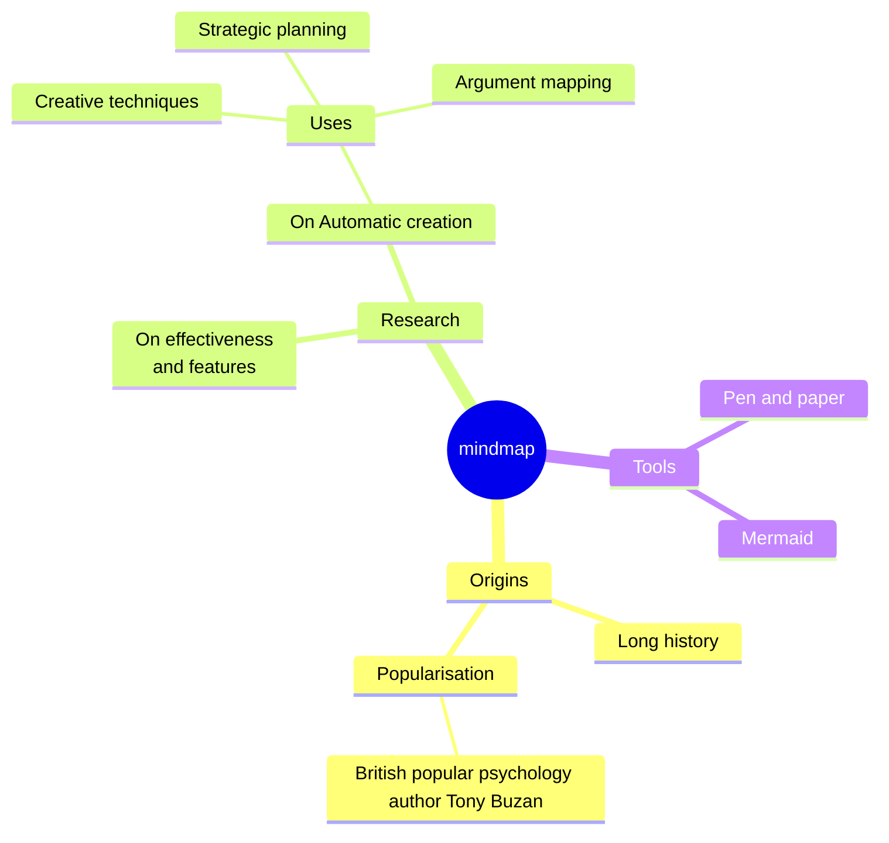

# Overview






# Dev Setup
```
git clone https://github.com/dtempx/syphonx-chrome.git
cd syphonx-chrome
yarn install
```


# Build/Test
* `npx tsc` to build source
* `yarn test` to run unit tests


# Build/Package
* `yarn build` to build Chrome Extension package
* `yarn start` to test UI outside of Chrome


# Test Chrome Extension
1. Open Chrome web-browser
2. Goto `chrome://extensions` to open the **Extensions** page
3. Click `Load unpacked` and navigate to `dist` folder to load Chrome Extension


# Install Chrome Extension
1. Open Chrome and navigate to **chrome://extensions**
2. Click **Load unpacked**, navigate to the `dist` folder within this project and click **Select Folder**
3. Navigate to any website and open developer tools or hit F12
4. Select the **SyphonX** tab within the developer tools panel.


# Deploy
1. Update version number in manifest.json
2. Zip the dist directory
3. Goto https://github.com/dtempx/syphonx-chrome/releases/
4. Click **Draft new release**
5. Set tag to `beta`
6. Set name to the version number
7. Add zip file
8. Check **Set as a pre-release**
8. Click **Publish release**


# Links
* [Material UI Documentation](https://v4.mui.com/)
* [Chrome Extending DevTools](https://developer.chrome.com/docs/extensions/mv3/devtools/)
* [Building a Chrome Extension with TypeScript (starter overview)](https://www.youtube.com/watch?v=01vp9cYbQus)


# Other

## Add jQuery to any page
```js
(() => {
    const script = document.createElement('script');
    script.src = 'https://ajax.googleapis.com/ajax/libs/jquery/3.6.0/jquery.slim.min.js';
    document.getElementsByTagName('head')[0].appendChild(script);
    //jQuery.noConflict();
})();
```

## Add SyphonX to any page
1. Hit F12 from the active tab to open devtools and goto Console
2. Copy/paste contents of `dist/syphonx.js` file to devtools console
3. Paste the code below to run a SyphonX query
```js
await window.syphonx.extract({actions:[{select:[{name:"title",query:[["h1"]]}]}]})
```

## Run SyphonX query manually within the page context
1. Hit F12 from the active tab to open devtools and goto Console
2. Change the Console window context from `top` to `SyphonX`
3. Paste the code below to run a SyphonX query
```js
await window.syphonx.extract({actions:[{select:[{name:"title",query:[["h1"]]}]}]})
```

## Debug SyphonX within the page context
1. Hit F12 from the active tab to open devtools and goto Sources
2. Change the Sources window context from `Page` to `Content scripts`
3. Expand the `SyphonX` node and select `syphonx.js`
4. Set a breakpoint in the code editor

## Debug background
1. Goto chrome://extensions
2. Click the `service worker` to open devtools window
3. Select **Sources** view
4. Set a breakpoint in the code editor

## Debug panel
1. Right click on any element in the panel and select **inspect** to open the devtools window for the panel
2. Select **Sources** view
3. Drill down to **top > panel.html > {id} > src > panel > index.tsx** (or other desired source location)
4. Set a breakpoint in the code editor

## Misc
How to get the Selected elements in Chrome Panel? [Chrome Extension Development] [XPath Selenium]
https://www.youtube.com/watch?v=tFpU95kMJ7U&list=PL699Xf-_ilW7aQ6lBWXjaIheZsduOpcR5&index=10

```js
chrome.devtools.panels.elements.createSidebarPane("LetXPath", panel => {
    chrome.devtools.panels.elements.onSelectionChanged.addListener(() => {
        panel.setExpression(`$0.attributes`);
    });
});
```

Build XPath Form Selected Node | Chrome Extension Development | XPath Selenium | LetCode
https://www.youtube.com/watch?v=EuGxrTCj5Ac&list=PL699Xf-_ilW7aQ6lBWXjaIheZsduOpcR5&index=12

* https://developer.chrome.com/docs/extensions/mv3/getstarted/
* https://developer.chrome.com/docs/extensions/mv3/devtools/
